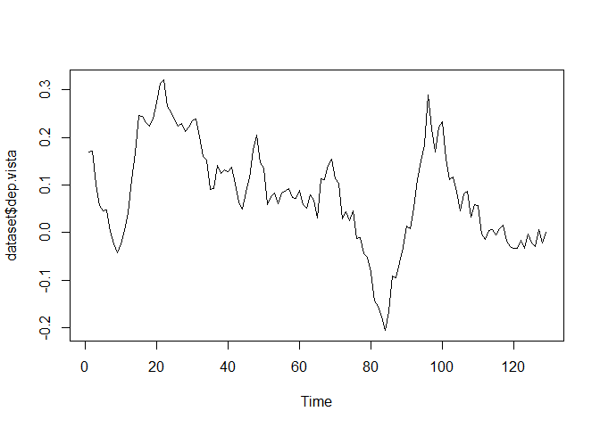
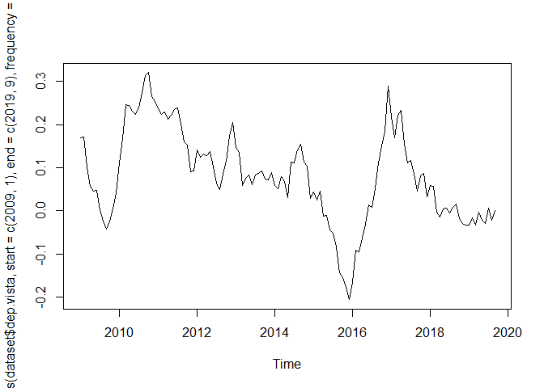
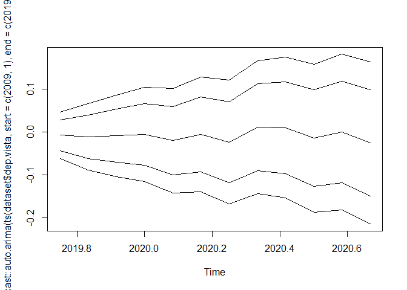
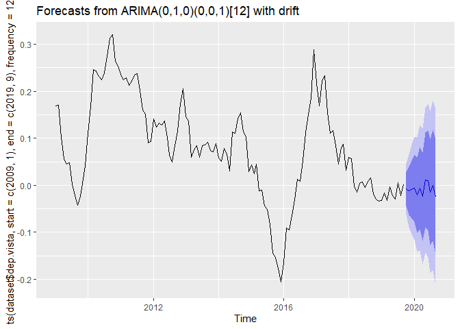
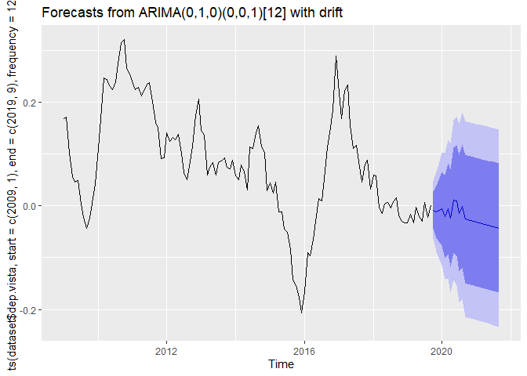
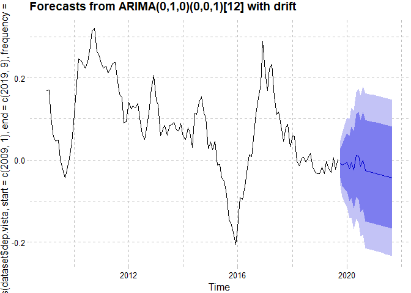
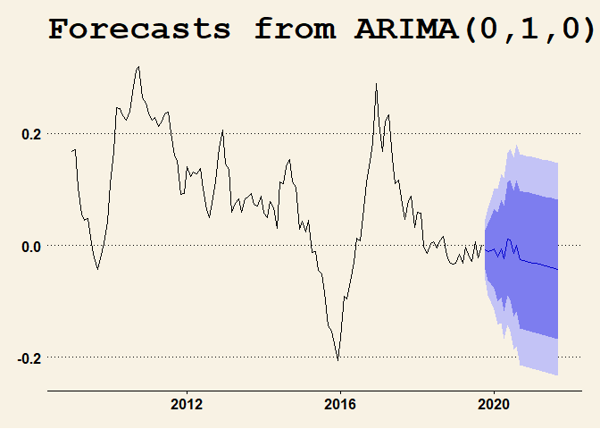
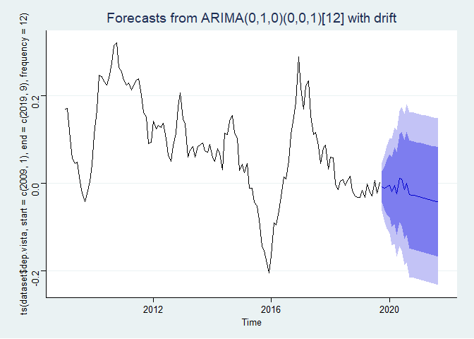
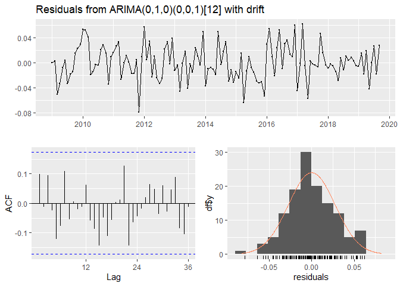
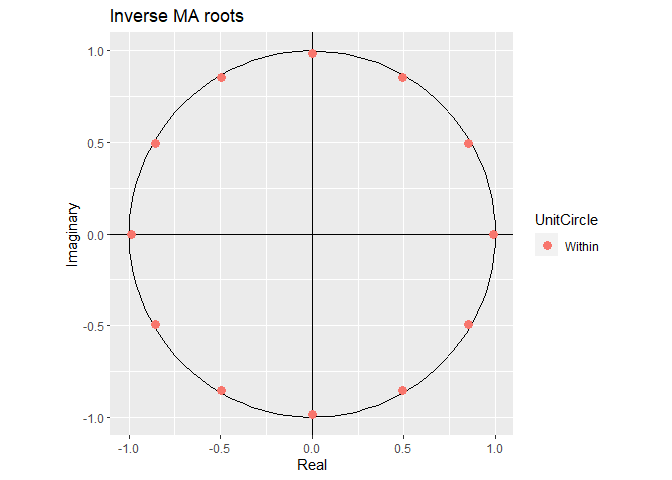

Modelos de Series Temporales para Pronóstico en los Negocios
================
CasaresFelix

# CARGANDO LIBRERIAS

``` r
library(tsibble)
```

    ## 
    ## Attaching package: 'tsibble'

    ## The following objects are masked from 'package:base':
    ## 
    ##     intersect, setdiff, union

``` r
library(feasts)
```

    ## Loading required package: fabletools

``` r
library(ggplot2)
library(openxlsx)
library(dplyr)
```

    ## 
    ## Attaching package: 'dplyr'

    ## The following objects are masked from 'package:stats':
    ## 
    ##     filter, lag

    ## The following objects are masked from 'package:base':
    ## 
    ##     intersect, setdiff, setequal, union

``` r
library(ggthemes)
library(reshape2)
library(fable)
```

    ## Warning: package 'fable' was built under R version 4.2.3

``` r
library(lubridate)
```

    ## Loading required package: timechange

    ## 
    ## Attaching package: 'lubridate'

    ## The following object is masked from 'package:tsibble':
    ## 
    ##     interval

    ## The following objects are masked from 'package:base':
    ## 
    ##     date, intersect, setdiff, union

# CARGANDO LA BASE DE DATOS

``` r
dataset <- openxlsx::read.xlsx("c:/Users/GIGATRONICS/Desktop/rec.xlsx",
                   sheet="Hoja2",detectDates = T)


dataset <-dataset %>%
  select(c(fecha_corte,dep.vista,col.cart,
           exportaciones,
           mucif_duraderos))

ts.plot(dataset$dep.vista)
```

<!-- -->

# transformacion a TS

``` r
plot(ts(dataset$dep.vista, start = c(2009,01),end = c(2019,09),frequency = 12))
```

<!-- -->

\#modelo de forecast automatico

``` r
forecast::auto.arima(ts(dataset$dep.vista, start = c(2009,01),end = c(2019,09),frequency = 12))
```

    ## Registered S3 method overwritten by 'quantmod':
    ##   method            from
    ##   as.zoo.data.frame zoo

    ## Series: ts(dataset$dep.vista, start = c(2009, 1), end = c(2019, 9), frequency = 12) 
    ## ARIMA(0,1,0)(0,0,1)[12] with drift 
    ## 
    ## Coefficients:
    ##          sma1    drift
    ##       -0.8635  -0.0015
    ## s.e.   0.1203   0.0007
    ## 
    ## sigma^2 = 0.0007652:  log likelihood = 270.59
    ## AIC=-535.19   AICc=-534.99   BIC=-526.63

# pronostico con modelo

``` r
#hola

forecast::forecast(forecast::auto.arima(ts(dataset$dep.vista, start = c(2009,01),end = c(2019,09),frequency = 12)),12)
```

    ##          Point Forecast       Lo 80      Hi 80       Lo 95      Hi 95
    ## Oct 2019  -0.0079989540 -0.04363544 0.02763754 -0.06250026 0.04650235
    ## Nov 2019  -0.0118739574 -0.06227156 0.03852365 -0.08895045 0.06520253
    ## Dec 2019  -0.0091211396 -0.07084535 0.05260307 -0.10352017 0.08527789
    ## Jan 2020  -0.0058399149 -0.07711289 0.06543306 -0.11484253 0.10316270
    ## Feb 2020  -0.0204947810 -0.10015871 0.05916915 -0.14233025 0.10134069
    ## Mar 2020  -0.0059896206 -0.09324124 0.08126200 -0.13942946 0.12745022
    ## Apr 2020  -0.0237618983 -0.11799220 0.07046841 -0.16787471 0.12035092
    ## May 2020   0.0108769997 -0.08984963 0.11160363 -0.14317109 0.16492509
    ## Jun 2020   0.0097994260 -0.09702922 0.11662807 -0.15358088 0.17317973
    ## Jul 2020  -0.0146846242 -0.12728508 0.09791583 -0.18689216 0.15752291
    ## Aug 2020  -0.0005406976 -0.11863120 0.11754981 -0.18114454 0.18006314
    ## Sep 2020  -0.0255257293 -0.14886214 0.09781069 -0.21415250 0.16310104

``` r
ts.plot(forecast::forecast(forecast::auto.arima(ts(dataset$dep.vista, start = c(2009,01),end = c(2019,09),frequency = 12)),12))
```

<!-- -->

``` r
autoplot(forecast::forecast(forecast::auto.arima(ts(dataset$dep.vista, start = c(2009,01),end = c(2019,09),frequency = 12)),12))
```

<!-- -->

# guardando modelo

``` r
modelo1 <- forecast::auto.arima(ts(dataset$dep.vista, start = c(2009,01),end = c(2019,09),frequency = 12))

autoplot(forecast::forecast(modelo1))
```

<!-- -->

``` r
autoplot(forecast::forecast(modelo1)) +ggthemes::theme_pander()
```

<!-- -->

``` r
autoplot(forecast::forecast(modelo1)) +ggthemes::theme_wsj()
```

<!-- -->

``` r
autoplot(forecast::forecast(modelo1)) +ggthemes::theme_stata()
```

<!-- -->

# validando modelo

``` r
forecast::accuracy(modelo1)
```

    ##                        ME       RMSE        MAE      MPE     MAPE      MASE
    ## Training set 0.0001263061 0.02733906 0.02137649 39.05479 105.1332 0.1806526
    ##                    ACF1
    ## Training set 0.09853432

``` r
forecast::checkresiduals(modelo1)
```

<!-- -->

    ## 
    ##  Ljung-Box test
    ## 
    ## data:  Residuals from ARIMA(0,1,0)(0,0,1)[12] with drift
    ## Q* = 22.248, df = 23, p-value = 0.5053
    ## 
    ## Model df: 1.   Total lags used: 24

``` r
autoplot(modelo1)
```

<!-- -->
